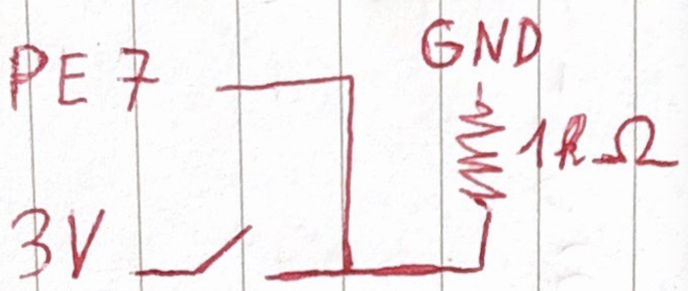

This project is a button sending command when it's pressed.

Currently used with https://github.com/Vrixyz/music.

# Schematics
- Bluetooth connection is used via a HC-05 module, connected as directed by https://rust-embedded.github.io/discovery/13-serial-over-bluetooth/index.html.
- External button is wired with a pull down resistor like this: 

# Installation
## Mac
I use built in bluetooth connection manager to pair the mac to the HC-05 module.
## Raspberry pi
- I connect via bluetoothctl, default-agent, pair, trust, connect.
- I encountered an issue on connect `Failed to connect: org.bluez.Error.NotAvailable`, I fixed thanks to https://www.raspberrypi.org/forums/viewtopic.php?p=947185#p947185

## TODO
### Interrupts
- Resources:
  - needs tweaks to be fixed: https://gist.github.com/JosephBGerber/007200db215dfdbef56fa583033bf19b
  - Above fix should be `cortex_m::peripheral::NVIC::unmask(stm32::Interrupt::EXTI0)`: understood from: https://github.com/stm32-rs/stm32f4xx-hal/blob/9c0ebd7c6162fdaa9cdaf20273c6d5f4b6457708/examples/stopwatch-with-ssd1306-and-interrupts.rs#L96
